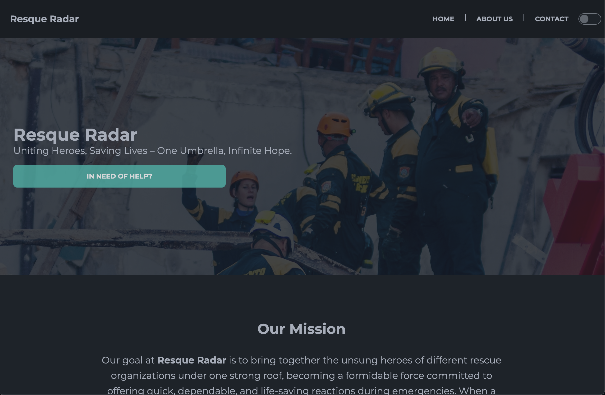
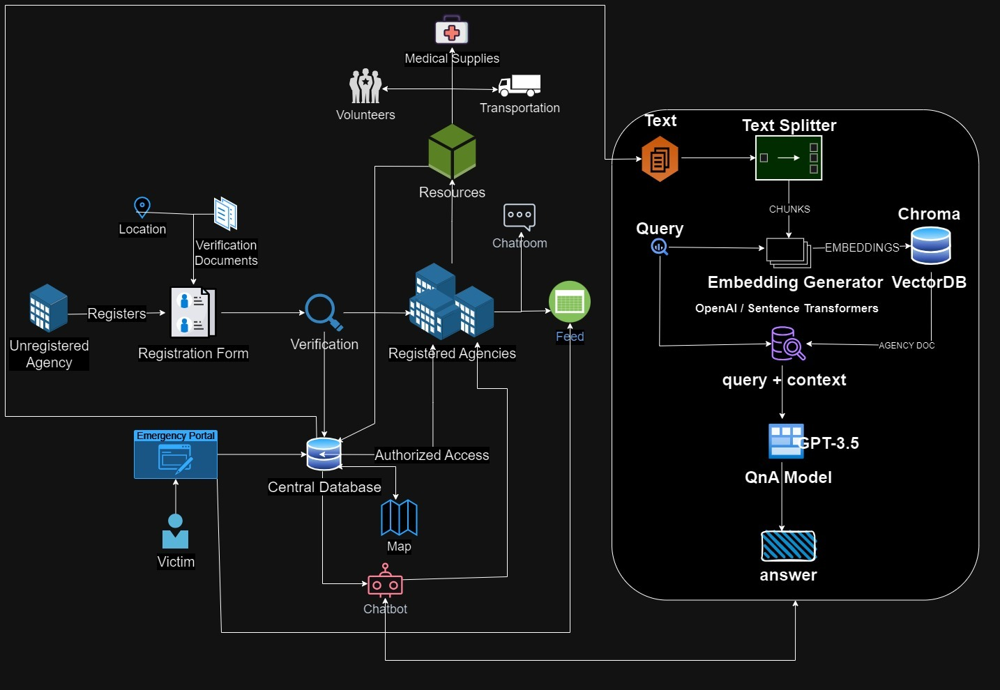

|  |  |
| :---: | :---: |

   


Resque Radar is a cutting-edge application designed to revolutionize disaster response and relief efforts. In the face of natural or man-made calamities, it serves as a centralized platform where all rescue agencies can register and collaborate seamlessly. This innovative digital solution empowers rescue and relief organizations to work cohesively during crises, ultimately saving lives and minimizing damage.

You can find the live site <a href="https://rescueradar.azurewebsites.net/" target="_blank">here</a>.

## Table of Contents

- [Table of Contents](#table-of-contents)
- [Installation](#installation)
  - [Prerequisites](#prerequisites)
  - [Clone](#clone)
  - [Setup](#setup)
- [Working](#working)
- [Contributors](#contributors)
- [License](#license)

## Installation

### Prerequisites

- [Django](https://www.djangoproject.com/)
- [Python](https://www.python.org/)
- [PostgreSQL](https://www.postgresql.org/)
  
### Clone

- Clone this repo to your local machine using the following command:

```shell
https://github.com/RescueRadar/resque-radar
```

### Setup

- You can either create a virtual environment or install the dependencies globally. We recommend using a virtual environment. To create a virtual environment, run the following command:

```shell
python -m venv venv
source venv/bin/activate
```

- Download the dependencies using the following command:

```shell
pip install -r requirements.txt
```

- Create a `.env` file in the root directory and add the following environment variables:

```shell
DB_USER="your_db_username"
DB_HOST="your_db_host"
DB_PASSWORD="your_db_password"
DB_NAME="your_db_name"
```

- Run the following commands to create the database and apply migrations:

```shell
python manage.py makemigrations
python manage.py migrate
```

- Create a superuser to access the admin dashboard using the following command:

```shell
python manage.py createsuperuser
```

- Run the following command to start the server:

```shell
python manage.py runserver 0.0.0.0:8000
```

- You can now access the site at `http://localhost:8000/`.

## Working



## Contributors

This project was made for the [Smart India Hackathon 2023](https://www.sih.gov.in/) for the problem statement 1440. The team members are:

- [Abhishek Sahoo](https://github.com/abhisek-1221) - Team Lead
- [Rachit Khurana](https://github.com/notnotrachit) - Django Developer
- [Chirag Aggarwal](https://github.com/ChiragAgg5k) - Frontend Developer
- [Aviral](https://github.com/PlasmicZ) - UI Designer
- [Tanmay](https://github.com/JagritiGautam793) - Research and Documentation
- [Jagriti Gautum](https://github.com/TanmayChachra) - AI and ML

## License

This project is licensed under the MIT License - see the [LICENSE](/LICENSE.md) file for details.